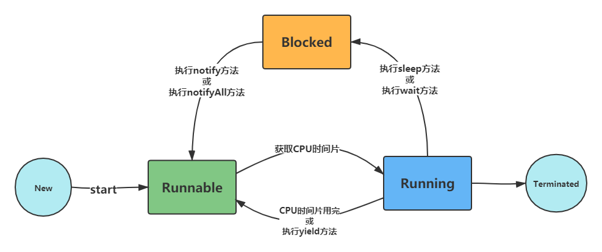

+++

author = "云腾"
title = "Java多线程详解"
date = "2021-08-23"
tags = [
    "线程",
]
categories = [
    "java",
]

+++

## 何为线程？

> **线程**（thread）是操作系统能够进行运算调度的**最小单位**。它被包含在进程之中，是进程中的实际运作单位。一条线程指的是进程中一个单一顺序的控制流，一个进程中可以并发多个线程，每条线程并行执行不同的任务。

## Java线程的生命周期

新建（New）：

就绪（Runnable）：

运行（Running）:

阻塞（Blocked）:

销毁（Terminated）：
