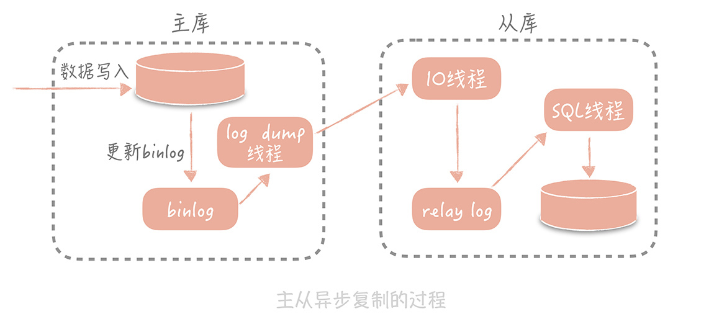

+++

author = "云腾"
title = "《重构第二版》笔记"
date = "2021-10-23"
tags = [
    "复习",
]
categories = [
     "book","笔记"
]

+++

> 从古至今，长江和黄河流域水患不断，远古时期，大禹曾拓宽河道，清除淤沙让流水更加顺畅；都江堰作为史上最成功的的治水案例之一，用引流将岷江之水分流到多个支流中，以分担水流压力；三门峡和葛洲坝通过建造水库将水引入水库先存储起来，然后再想办法把水库中的水缓缓地排出去，以此提高下游的抗洪能力。

高并发的处理方式目前有三种方式

1. Scale-out(横向扩展)：采用分布式部署的方式把流量分流开，让每个服务器都承担一部分并发和流量。
2. 缓存：使用缓存来提高系统的性能（空间换时间）
3. 异步：某些场景下，处理未完成的请求时，可以先让请求返回，数据准备好之后返回请求方。这样可以在单位时间内处理更多的请求。

OSI 网络模型分层：物理层、数据链路层、   网络层、传输层、       会话层、表现层、应用层。

TCP/IP 协议分层：            链路层、                网络层、传输层、                 应用层。

## 高可用系统设计的思路

1. 系统设计

   - failover机制

   - 超时调整

   - 降级、限流

2. 系统运维

   - 灰度发布

   - 故障演练

## 高可扩展性的设计思路

1. 拆分，将复杂问题简单化
2. 

#### 1. 存储层的扩展性

- 业务维度
- 数据库维度

#### 2. 业务层的扩展性

- 业务
- 重要性
- 请求来源

对于数据库连接池，根据我的经验，一般在线上我建议最小连接数控制在 10 左右，最大连接数控制在 20～30 左右即可。

java线程池学习（重要）

在 4 核 8G 的机器上运 MySQL 5.7 时，大概可以支撑 500 的 TPS 和 10000 的 QPS

Mysql主从复制

主从同步过程：从库在连接到主节点时，会创建一个IO线程，用来请求主库的binlog。把接收到的binlog信息写入relay log的日志文件中。而主库也会创建一个log dump的线程来发送binlog给从库。同事，从库还会创建一个SQL线程读取relay log中的内容，然后做回放将信息写入从库。

同步延迟导致短时间数据不一致问题处理方案

1. 数据冗余（推荐使用，效率高）
2. 使用缓存
3. 查询主库

## 倒排索引

倒排索引是指将记录中的某些列做分词，然后形成的分词与记录 ID 之间的映射关系。比如说，你的垂直电商项目里面有以下记录：

.jpg)

那么，我们将商品名称做简单的分词，然后建立起分词和商品 ID 的对应关系，就像下面展示的这样：

.jpg)

### 分布式缓存的高可用的3种主流方案

1. 客户端方案，一般也称为 Smart Client。我们通过制定一些数据分片和数据读写的策略，可以实现缓存高可用。这种方案的好处是性能没有损耗，缺点是客户端逻辑复杂且在多语言环境下不能复用。

2. 中间代理方案，在客户端和缓存节点之间增加了中间层，在性能上会有一些损耗，在代理层会有一些内置的高可用方案，比如 Codis 会使用 Codis Ha 或者 Sentinel。

3. 服务端方案，依赖于组件的实现，Memcached 就只支持单机版没有分布式和 HA 的方案，而 Redis 在 2.4 版本提供了 Sentinel 方案可以自动进行主从切换。服务端方案会在运维上增加一些复杂度。

### 解决缓存穿透问题的2种最主要的解决方案

1. 回种空值是一种最常见的解决思路，实现起来也最简单，如果评估空值缓存占据的缓存空间可以接受，那么可以优先使用这种方案；

2. 布隆过滤器会引入一个新的组件，也会引入一些开发上的复杂度和运维上的成本。所以只有在存在海量查询数据库中，不存在数据的请求时才会使用，在使用时也要关注布隆过滤器对内存空间的消耗；

3. 对于极热点缓存数据穿透造成的“狗桩效应”，可以通过设置分布式锁或者后台线程定时加载的方式来解决。

