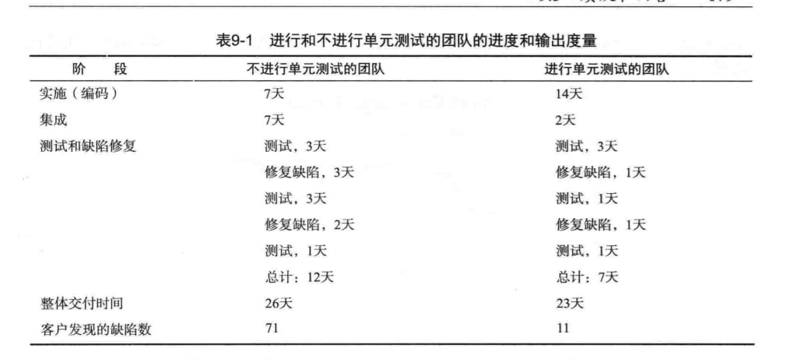

+++

author = "云腾"
title = "《单元测试的艺术》笔记"
date = "2021-10-23"
tags = [
    "单测",
]
categories = [
    "book","笔记"
]

+++

## 优秀单元测试特性

1. 他应该是自动化的，可重复执行
2. 他应该很容易实现
3. 他应该第二天还有意义
4. 任何人都应该一键运行他
5. 他应该运行速度很快
6. 他的结果应该是很稳定的（如果运行之间没有修改，多次运行一个测试应该返回相同的结果）
7. 他应该能完全控制被测试的单元
8. 他应该是完全隔离的（独立于其他测试的运行）
9. 如果他失败了，我们应该很容易发现什么是期待结果，进而定位问题

## 单元测试不等于集成测试

任何测试，如果他运行不快，结果不稳定，或者用到被测试单元的一个或多个真实依赖物，我们就认为他是**集成测试**。

单元测试也可以共用方法，使代码一目了然

## 存根（stub）和模拟对象的区别

存根是用来模拟各种场景的测试对象

## 细节

测试过程中，如果一个断言失败了，那么不需要关心后面的断言

单元测试，只做**一件**事情

## Mock

Mocks are used as a replacement for a dependency.、

## 断言注意

单元测试中不应该有多个断言，如果有的话，可分成2个单元测试。避免多个关注点

覆盖率低于20%说明缺少很多测试

断言中的**魔法值**应该用常量的英文单词，可一眼看出预期。

断言和操作分离

单元测试失败的原因：要改变人的习惯，更多的是做出心理上的改变，而非技术上的。人们不喜欢改变，改变通常伴随着害怕、不确定和怀疑。

​					——摘自《单元测试的艺术》

研究表明：大部分的缺陷并不是来自代码自身，而是由人们之间的误解、不断变化的需求以及缺少应用领域知识造成的。

